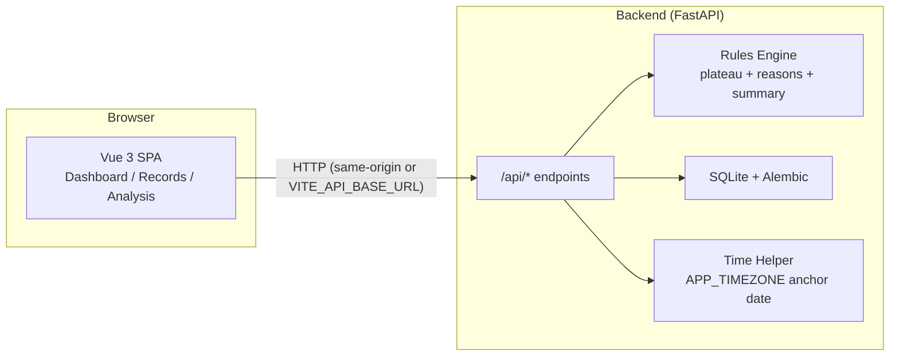

# PlateauBreaker

以「資料契約清楚、時間語義正確、可測試可部署」為目標的全端作品：記錄每日健康指標，並用規則引擎做 **體重停滯（plateau）偵測**與 **原因分析**。

## 作品亮點（求職展示重點）

- **時間語義收斂**：所有「today / 最近 7 天」都走同一套 `APP_TIMEZONE`（預設 `Asia/Taipei`）的 anchor date，避免部署在 UTC 主機造成日期偏移。
- **資料契約防線完整**：`record_date` 在 backend 端拒絕未來日期（422 + 可讀錯誤），前端驗證不再是唯一防線。
- **時間戳契約明確**：`created_at / updated_at` 統一輸出 **ISO 8601 UTC + `Z`**，避免 naive datetime 的模糊語義。
- **API contract 單一真相**：以 **FastAPI OpenAPI** 為唯一來源，前端型別由 **openapi-typescript** 生成，並在 CI 內做 drift 檢查。
- **CI 更像正式作品**：backend / frontend 都有 coverage gate + integration smoke（啟動 backend、驗證主要 API、驗證前端 build 可服務）。
- **交付可落地**：提供 `Dockerfile` + `docker-compose.yml` 一鍵啟動 demo；release zip 由腳本生成並驗證內容乾淨。

## Screenshots


## Tech Stack

- Backend: FastAPI + SQLModel + Alembic + SQLite
- Frontend: Vue 3 + Vite + Pinia + PrimeVue + Chart.js
- Contract: OpenAPI → openapi-typescript → `frontend/src/generated/api.ts`
- CI: GitHub Actions（lint / test / coverage / contract / migration / integration / release packaging）

## Architecture



## Quick Start（本機開發）

### Backend（Python 3.11+）

```powershell
cd backend
python -m venv .venv
.\.venv\Scripts\Activate.ps1
python -m pip install -r requirements.txt -c constraints.txt
python -m pip install -r requirements-dev.txt -c constraints.txt

# migrations
alembic -c alembic.ini upgrade head

# dev server
uvicorn app.main:app --reload --host 127.0.0.1 --port 8000 --env-file ../.env
```

### Frontend（Node 20.19+）

```powershell
cd frontend
npm ci
npm run dev
```

- dev 模式下，Vite 會 proxy `/api` → `http://localhost:8000`（見 `frontend/vite.config.ts`）。
- 若要直連後端（或部署在不同網域），設定 `VITE_API_BASE_URL`（見 `frontend/.env.example`）。

## Docker（最小可交付 demo）

```bash
docker compose up --build
```

打開 `http://localhost:8000`（backend 會同時提供 SPA + `/api/*`）。

## 部署重點（history mode）

此專案 router 使用 `createWebHistory`。若你把前端獨立部署到 Nginx / Static host，必須做 rewrite：

```nginx
location / {
  try_files $uri $uri/ /index.html;
}
```

本 repo 的 Docker 方案由 backend 端提供 SPA fallback（refresh `/analysis` 不會 404）。

## API Contract Strategy（單一真相）

1. backend OpenAPI 是唯一來源（FastAPI / Pydantic schemas）。
2. 生成前端型別：`frontend/src/generated/api.ts`
3. CI 會跑 `python scripts/check_api_contract.py`，確保 schema 變更不會讓前後端漂移。

本機更新流程：

```bash
python scripts/export_openapi.py --out frontend/openapi.json
npm --prefix frontend run generate:api
python scripts/check_api_contract.py
```

## 時間語義與資料契約（重要）

- `APP_TIMEZONE`（預設 `Asia/Taipei`）定義「今天」與分析視窗 anchor date。
- `record_date`（`YYYY-MM-DD`）在 server-side 會拒絕未來日期（422）。
- `created_at / updated_at` 一律輸出 `YYYY-MM-DDTHH:mm:ss.sssZ`（UTC + `Z`）。

細節見 `PlateauBreaker_Technical_Guide.md`。

## Engineering Decisions / Known Trade-offs

- 使用 SQLite 讓 demo 一鍵落地；資料量上來後可無痛切換 Postgres（Alembic 已就位）。
- Rules engine 採「可解釋」規則，而非黑盒模型；方便在求職展示時講清楚 trade-offs 與可測試性。
- 前端以 route-level code splitting 控制初始載入；Records chunk 較大（PrimeVue 表單/表格），但不影響首屏 Dashboard。

## Roadmap

- 增加 E2E（Playwright）作為 CI 可選 job（目前已提供 `frontend/scripts/capture-screenshots.mjs` 產生展示截圖）
- 支援多使用者 / auth（改用 Postgres + migrations）
- Analytics 指標擴充：週/月趨勢、睡眠與熱量關聯等

## 驗收（本 repo 的必做門檻）

```bash
# backend
cd backend
ruff check .
pytest -q --cov=app --cov-fail-under=80
alembic -c alembic.ini upgrade head

# frontend
cd ../frontend
npm ci
npm run lint
npm test -- --run --coverage
npm run build

# contract drift
cd ..
python scripts/check_api_contract.py

# release
python scripts/make_release_zip.py --out-dir release
python scripts/validate_release_zip.py --out-dir release
```

