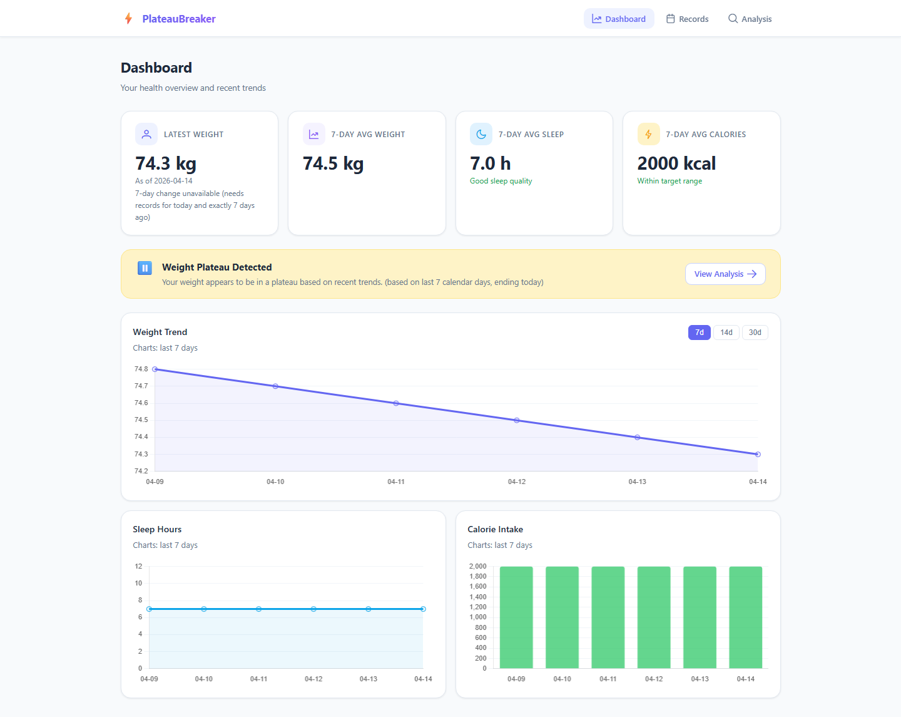
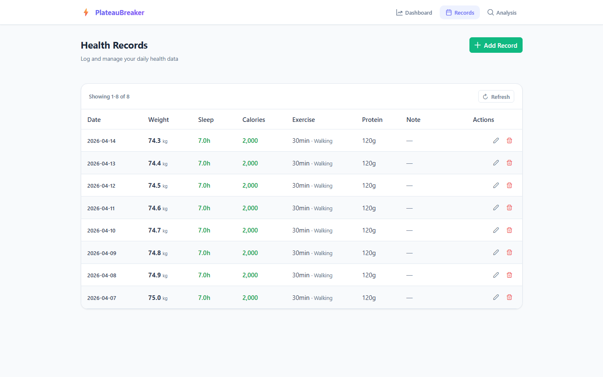
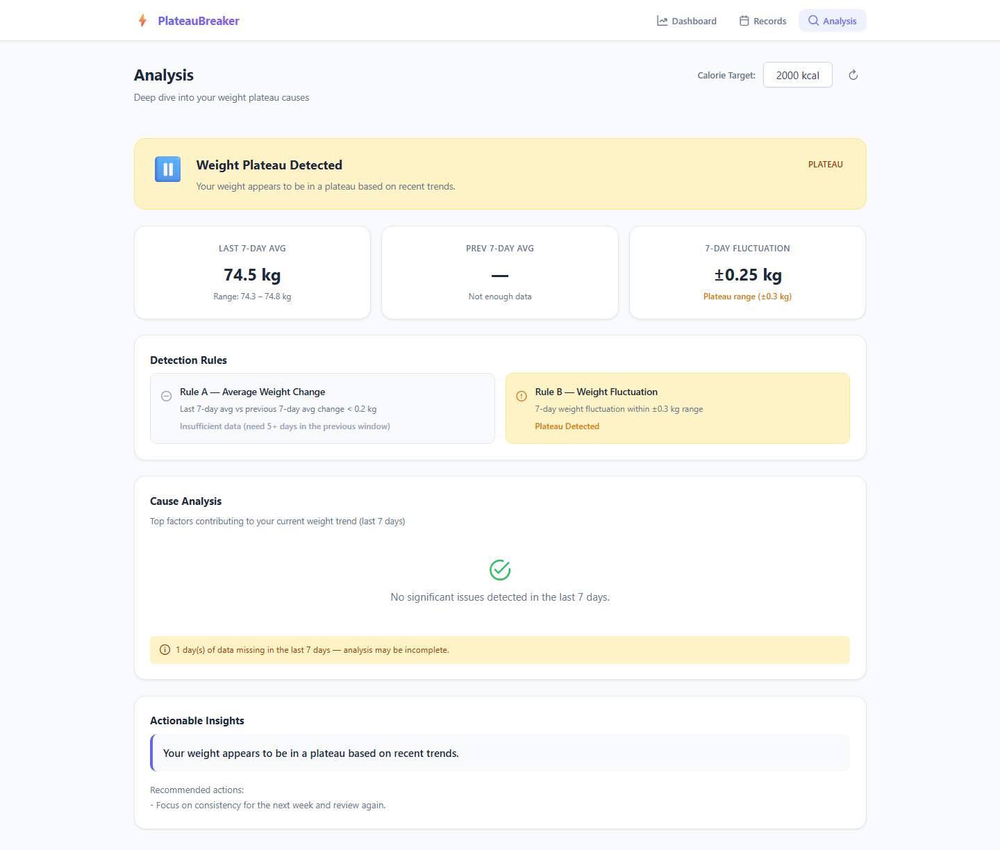

# PlateauBreaker

PlateauBreaker 是一個「體重停滯（plateau）偵測 + 建議」的小型全端作品：
- Backend: FastAPI + SQLModel + Alembic + SQLite（DB-level CHECK constraints）
- Frontend: Vue 3 + Vite + Pinia + PrimeVue
- Contract: OpenAPI 匯出後由 `openapi-typescript` 生成 `frontend/src/generated/api.ts`，CI 會檢查 drift

## Screenshots





## Requirements

- Python: 3.11（CI 使用 3.11）
- Node: 20.19.0（由 repo root `.nvmrc` 固定；`frontend/.npmrc` 啟用 `engine-strict`）

## Quick Start

### Backend

```powershell
cd backend
python -m venv .venv
.\.venv\Scripts\Activate.ps1
python -m pip install -r requirements.txt -c constraints.txt
python -m pip install -r requirements-dev.txt -c constraints.txt

# Apply migrations
alembic -c alembic.ini upgrade head

# Dev server
uvicorn app.main:app --reload --host 127.0.0.1 --port 8000 --env-file ../.env
```

### Frontend

```powershell
cd frontend
npm ci
npm run dev
```

- Dev server 會 proxy `/api` 到 `http://localhost:8000`（見 `frontend/vite.config.ts`）
- 若不使用 proxy（或 production），請設定 `VITE_API_BASE_URL`（見 `frontend/.env.example`）

## Docker (demo)

```bash
docker compose up --build
```

打開 `http://localhost:8000`：Backend 會在有 build artifact 時提供 SPA（並處理 history fallback）。

## CI Parity: Local Verification (與 CI 一致的驗收命令)

以下命令對齊 `.github/workflows/ci.yml`；建議從 repo root 依序執行：

```bash
# contract
python scripts/check_version_sync.py
python scripts/check_api_contract.py

# backend
cd backend
ruff check .
mypy app/
pytest -q
alembic -c alembic.ini upgrade head

# frontend
cd ../frontend
npm ci
npm run lint
npm run test:ci
npm run build

# release packaging (smoke)
cd ..
python scripts/make_release_zip.py --out-dir release
python scripts/validate_release_zip.py --out-dir release

# integration smoke (backend serves built frontend)
python scripts/smoke_test_ci.py

# e2e (Playwright)
cd frontend
npx playwright install --with-deps
npx playwright test
```

